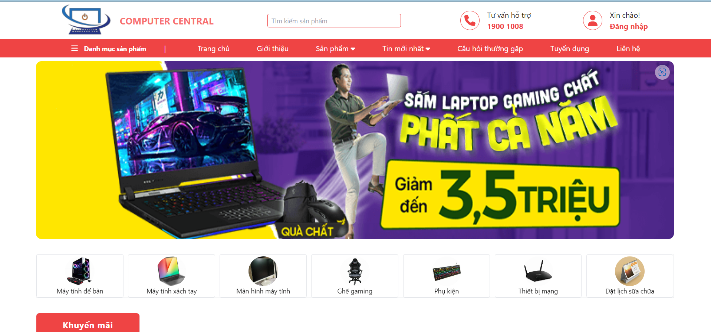
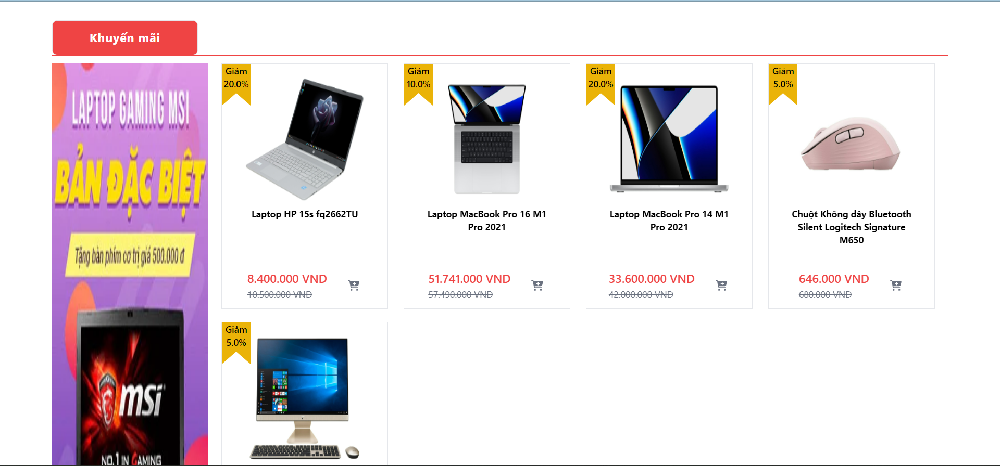
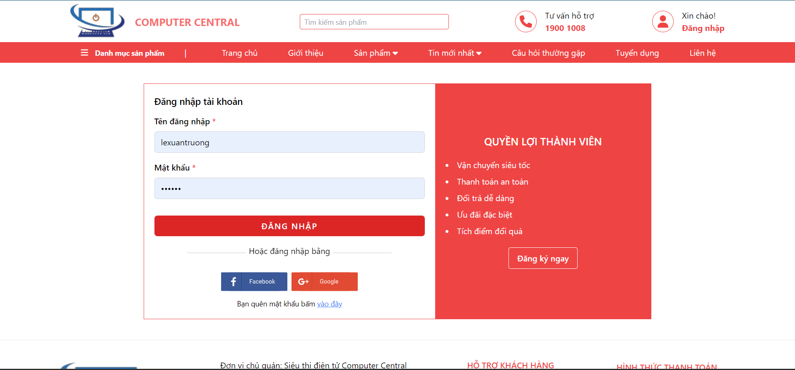
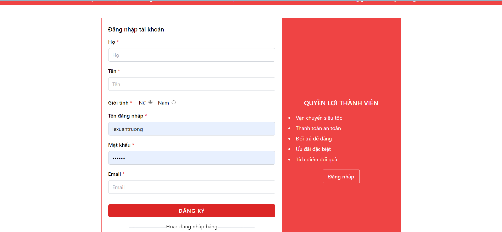
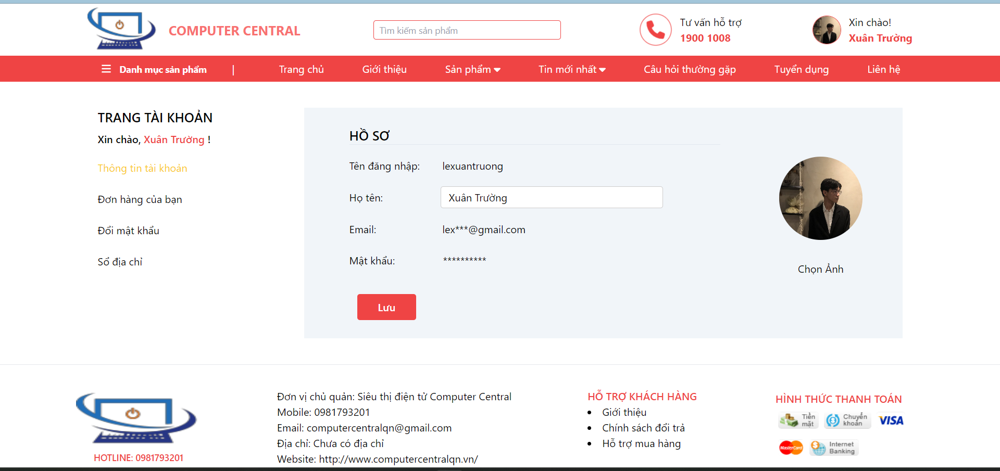
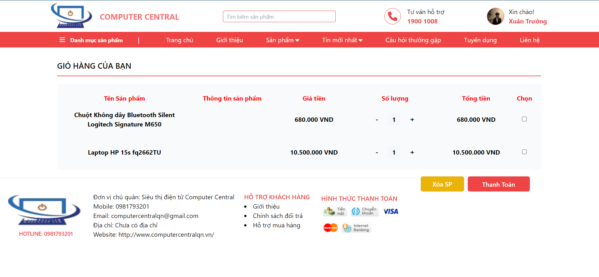
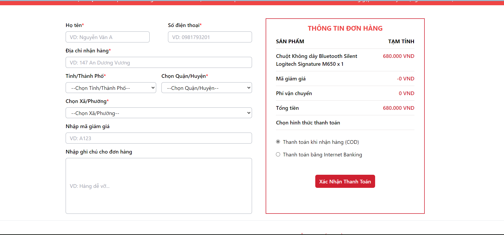

# I. Giới thiệu sản phẩm
    Computer Central là một trang web bán hàng uy tín với hàng loạt sản phẩm máy tính chính hãng, từ máy tính xách tay cho đến máy tính để bàn và phụ kiện máy tính. Đây là một địa chỉ tin cậy dành cho những ai muốn mua các sản phẩm máy tính với chất lượng tốt nhất.

    Tất cả các sản phẩm tại Computer Central đều được bảo hành chính hãng và đảm bảo chất lượng tốt nhất. Họ còn cung cấp dịch vụ giao hàng nhanh và miễn phí trong nội thành.

    Chúng tôi cam kết về chất lượng sản phẩm của cửa hàng và đội ngũ nhân viên chuyên nghiệp, nhiệt tình, tận tâm. Đặc biệt, chúng tôi còn có chương trình khuyến mãi hấp dẫn, giúp khách hàng có thể mua được sản phẩm mà mình mong muốn với giá cả hợp lý nhất.

    Một điểm nổi bật của Computer Central là họ cung cấp dịch vụ bảo hành và sữa chữa tại nhà cho khách hàng. Bạn chỉ cần đặt lịch hẹn trên trang web và nhân viên sẽ đến tận nhà để giải quyết sự cố của bạn một cách nhanh chóng và hiệu quả.

    Computer Central còn cung cấp một trải nghiệm mua sắm trực tuyến tuyệt vời với giao diện đơn giản và dễ sử dụng. Bạn có thể dễ dàng tìm kiếm sản phẩm cần mua và đặt hàng một cách nhanh chóng và tiện lợi.

    Với tất cả những ưu điểm trên, Computer Central chính là một trang web bán hàng tốt nhất cho những ai muốn mua các sản phẩm máy tính chính hãng với giá cả hợp lý và dịch vụ tốt nhất. Hãy truy cập trang web của họ ngay hôm nay để tìm hiểu thêm về sản phẩm và dịch vụ của họ.

# II. Công nghệ sử dụng
    ReactJS, Redux, Tailwind, SASS, ...

# III. Các chức năng
    1. Đăng nhập 
    2. Đăng ký
    3. Xem danh sách sản phẩm 
    4. Xem chi tiêt sản phẩm
    5. Thêm sản phẩm vào giỏ hàng
    6. Tăng/Giảm số lượng đặt mua
    7. Tìm kiếm sản phẩm (Theo tên)
    8. Xem giỏ hàng
    9. Đặt hàng
    10. Xóa sản phẩm khỏi giỏ hàng
    11. Thay đổi thông tin cá nhân (Avatar/Họ tên/Mật khẩu/Email/Số điện thoại)
    12. Đặt lịch sữa chữa tại nhà
    13. Một số tính năng khác

# IV. Đường dẫn demo
    1. Source:
        1. Front-End: https://github.com/xuantruongg03/store
        2. Back-End: https://github.com/xuantruongg03/store-backend
    2. Demo: 
        1. Front-End: https://computer-central.netlify.app/
        2. Back-End: https://store-backend-y4q1.onrender.com/

# V. Demo
- Home

- Login

- Register

- Account

- Cart

- Pay

